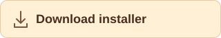

<h1 align="center">Cannoli</h1>
<p align="center">
A collection of godot addons inspired by popular unity assets
</p>
<p align="center">
  <a href="https://github.com/genr234/cannoli/releases/download/latest-build/cannoli_installer.zip"></a>
</p>

## Addons

| Addon | What it does | Download |
|---|---|---|
| [Relationships](addons/relationships/README.md) | NPCs that remember, take sides and spread gossip | [ZIP](https://github.com/genr234/cannoli/releases/download/latest-build/relationships.zip) |
| [Save](addons/save/README.md) | save slots and autosave, with recovery and migrations | [ZIP](https://github.com/genr234/cannoli/releases/download/latest-build/save.zip) |
| [Quests](addons/quests/README.md) | hand-written or generated quests, with dialogue and a journal | [ZIP](https://github.com/genr234/cannoli/releases/download/latest-build/quests.zip) |
| [Juice](addons/juice/README.md) | screen shake, hit stop, springs and other game feel | [ZIP](https://github.com/genr234/cannoli/releases/download/latest-build/juice.zip) |
| [Behaviors](addons/behaviors/README.md) | behavior trees and utility AI, with perception and steering | [ZIP](https://github.com/genr234/cannoli/releases/download/latest-build/behaviors.zip) |

The download links point to the newest `main` build that passed CI. Versioned
builds are on the [releases page](https://github.com/genr234/cannoli/releases).

## Requirements

- Godot 4.7 or later
- Python 3, to validate and build releases

## Install

Extract the installer into your project and enable **Cannoli Installer** in
**Project → Project Settings → Plugins**.

Open **Project → Tools → Cannoli Installer…**, pick a release and the addons you
want, then click **Install**.

To install without the installer, extract an addon ZIP into your project and
enable it in **Plugins**.

Updating replaces the whole addon folder. Commit any local changes first.

## Build a release

Validate the manifest and check the addons against Godot:

```bash
python3 tools/validate_manifest.py
python3 tools/check_godot.py --godot /path/to/godot
```

Build the ZIPs into `dist/`:

```bash
python3 tools/build_release.py dist
```

CI refreshes the downloads after every push to `main`. Push a `vX.Y.Z` tag for a
versioned release. To list an addon on the Godot Asset Library, see
[Asset Library publishing](docs/asset-library.md).

## License

[MIT](LICENSE) © 2026 genr234. If you redistribute an addon, keep the licenses
that ship with it.
